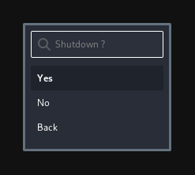

# wolo

An attempt to make something like lxde-logout for wayland with wofi.

Inspired by [this](https://github.com/luispabon/sway-dotfiles/blob/master/scripts/wofi-power.sh) and I added some modifications (confirmations, etc).

I'm using it on [dwl](https://github.com/djpohly/dwl) and systemd, so for logout, shutdown, and restart command, you can adapt it on your own.

Known issue :

- Icons don't render correctly (on debian), on archlinux just fine, I'm using Fontawesome from archlinux package.

